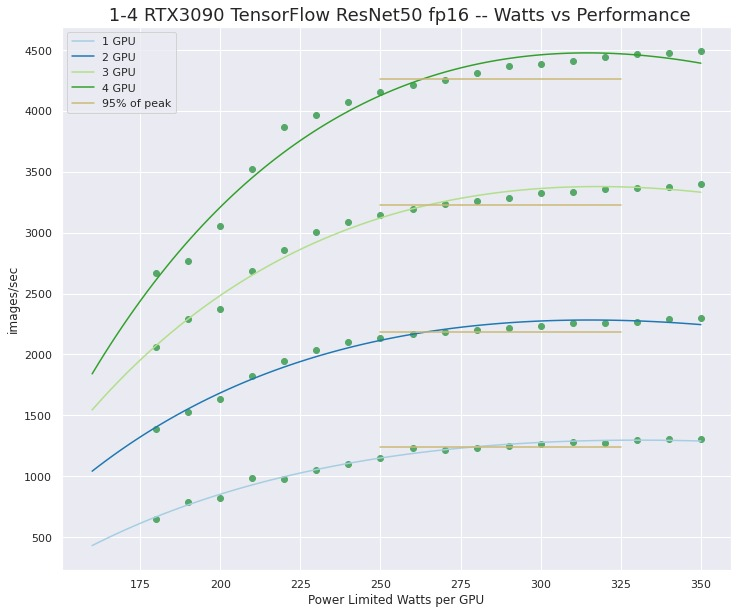

# nv-gpu-powerlimit-setup

## NVIDIA GPU Powerlimit Setup Script

### nvpl.sh -- VERSION: 0.2

This scrip can be used to interactively change the powerlimits for detected NVIDIA GPUs. Optionally it will create and install a systemd unit file that will set the powerlimits for NVIDIA GPUs at system boot.

**The nvpl.sh bash script is for Ubuntu >= 18.04 but should be easy to adapt to other distributions**

## Usage:

(**nvpl.sh --help**)

```
USAGE:  sudo ./nvpl.sh
[You will be prompted for GPU powerlimits to set.]

OPTIONALLY a config file will be stored in /usr/local/etc/nv-powerlimit.conf
and a systemd unit file will be created and installed to reset powerlimits on boot.

see:
https://www.pugetsystems.com/labs/hpc/Quad-RTX3090-GPU-Power-Limiting-with-Systemd-and-Nvidia-smi-1983/
for concept and motivation.

This script will;
- make sanity checks for OS version and NVIDIA GPUs
- interactively set powerlimits for NVIDIA GPUs found on system
- OPTIONALLY:
- create a config /usr/local/etc/nv-powerlimit.conf with the powerlimit values
- create and install /usr/local/sbin/nv-powerlimit.sh
- create and install /etc/systemd/system/nv-powerlimit.service
- enable nv-powerlimit.service
```

### ToDo:

- Next version will add flags for non-interactive use
  i.e. `nvpl.sh --powerlimit 0:300 1:280 --set-at-boot`

## Motivation:

The higher end NVIDA RTX desktop GPUs like the RTX3090, A5000, etc.. Make wonderful compute devises in a multi-GPU setup. However the default power limits are set very high. As much as 350W! **...next generation will be much higher than this!** Those high power limits can strain the the capability of a system power supply cooling capability and possibly even overload the circuit that the system is is plugged into.

Our testing has shown that lowering the power limit to more reasonable values has very little impact on performance. [https://www.pugetsystems.com/labs/hpc/Quad-RTX3090-GPU-Wattage-Limited-MaxQ-TensorFlow-Performance-1974/](https://www.pugetsystems.com/labs/hpc/Quad-RTX3090-GPU-Wattage-Limited-MaxQ-TensorFlow-Performance-1974/)


